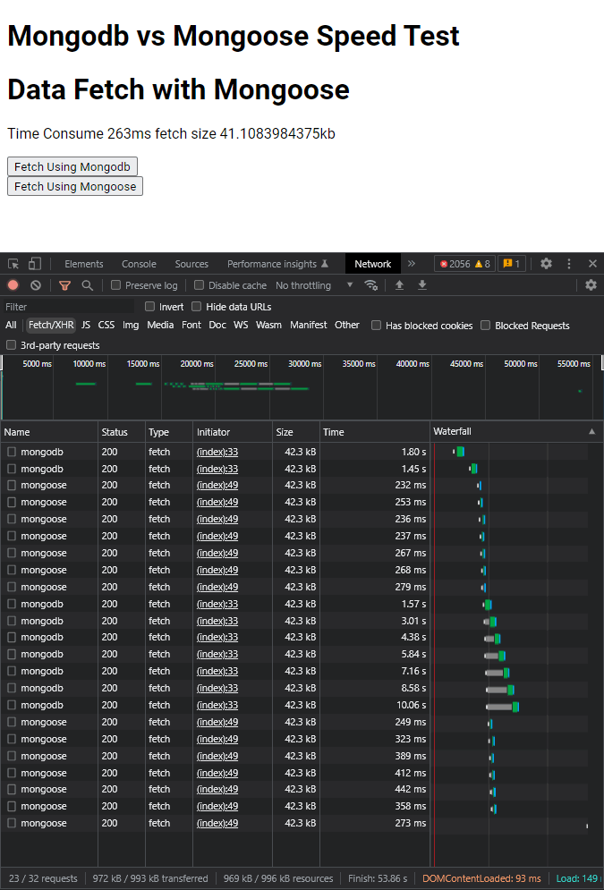

# Mongodb vs Mongoose Speed Test

This is simple check mongodb and mongoose data fetching speed
I make two route one for `mongoose` and another for raw node `mongodb`
```js
// for mongodb
 if(req.url === "/api/mongodb"){
	 let client = new MongoClient(URI);
	 try {
		 // Connect the client to the server
		 await client.connect();
		
		 // Establish and verify connection
		 let db = client.db("digital-store")
		 let COl =  db.collection("products")
		
		 let a = await db.command( { serverStatus: 1, latchAnalysis: 1 } )
		 console.log(a.connections.current)
		
		 let cursor = COl.find()
		 let products = []
		 await cursor.forEach(prod=>{
			 products.push(prod)
		 })
		 // send response to client	
	 } catch (ex) {
	 	// handle error
	 } finally {
			 // Ensures that the client will close when you finish/error
			 await client.close();
	 }
 }
```

```js
// for mongoose

mongoose.connect(URI).then(r => {
	console.log("mongoose connected.")
});


let Product = mongoose.model('Product', new mongoose.Schema({
	title: String,
	cover_photo: String,
	brand_id: mongoose.Schema.Types.ObjectId,
	category_id: mongoose.Schema.Types.ObjectId,
	discount: Number,
	price: Number,
	qty: Number,
	sold: Number,
	updated_at: Date,
	views: Number
}));

if(req.url === "/api/mongoose"){
	try {
		let p = await Product.find({})
		// send response
      
	} catch (ex){
		
  	}
}
```

## Preview App


